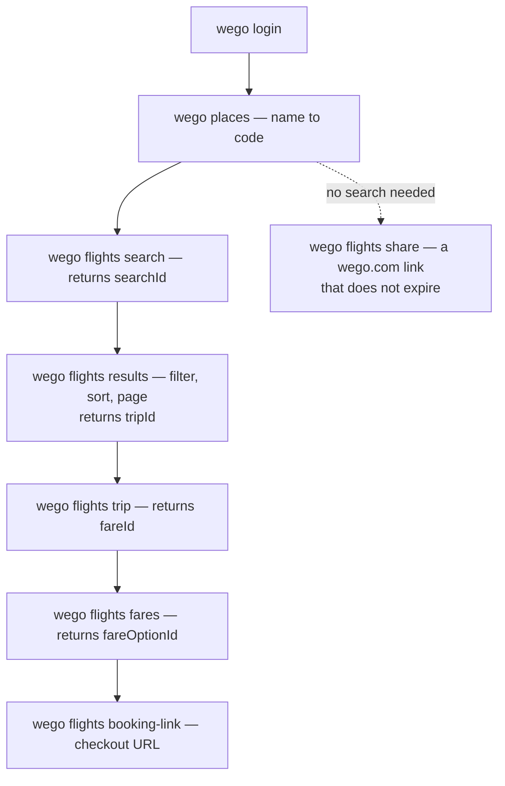

# `wego` CLI

Live flight and hotel search from the command line, and the runtime that the
[Wego agent skill](https://github.com/wego/skills) drives.

Made by [Wego](https://www.wego.com), the travel search engine and online travel
agency for the Middle East, North Africa and beyond. Docs, quickstart and use cases
live at [docs.wego.com](https://docs.wego.com); the CLI reference is at
[docs.wego.com/cli](https://docs.wego.com/cli) and the HTTP contract at
[docs.wego.com/api](https://docs.wego.com/api).

The `wego` command is a public OAuth + PKCE client. It logs you in against
`auth.wego.com` in your own browser, stores the token on your machine, and drives
the Wego API as you — resolving places, searching and comparing flights and hotels,
reading fares and room rates, refining an existing search instead of starting a new
one, and handing back a Wego or partner checkout link. Every price it prints came
from the response that carried it, never from an estimate.

The CLI and the skill divide the work. The CLI handles authorization, credential
storage, API access, one JSON envelope per command, a stable exit code, and
metering. The [skill](https://github.com/wego/skills) runs the conversation, ranks
the options, and decides where the user has to confirm.

## Works with

A single self-contained binary per platform, with no runtime to install:

| Platform | Architectures |
| --- | --- |
| macOS | `arm64`, `x64` |
| Linux | `x64`, `arm64` |
| Windows | `x64` |

One binary serves every backend. `--target prod|staging` picks one at run
time, and `prod` is what you get when you say nothing — a default that could be
non-production is how someone reads test inventory believing it is real.

For agents: anything that supports [skills](https://agentskills.io/) and can run a
binary — Claude Code, Codex, Cursor, OpenClaw, Hermes and Pi, to name a few. The
CLI carries the skill body embedded, so `wego skill install` writes it without a
download.

## Install

```bash
curl -fsSL https://docs.wego.com/cli/install | bash
```

Log in. The browser opens on your machine; over SSH the CLI prints a URL instead
and takes the redirect back by paste.

```bash
wego login
wego whoami
```

Install the agent skill, so a coding agent can drive the CLI for you:

```bash
wego skill install
```

Later releases arrive through the CLI itself. `wego update` replaces the binary
with the latest release from the ring this install follows, verifies the checksum
before swapping it in, and `wego update --check` only reports.

### Release rings

Three pointers, each serving a different build of the same CLI:

| Ring | Who it is for | Moves |
| --- | --- | --- |
| `stable` | everyone; the default install | on each release promote |
| `next` | early adopters, opt-in | ahead of `stable` |
| `edge` | engineers working on the CLI | every merge to `main` |

Install one by naming it, and you are done — the installer records the ring and
`wego update` follows it from then on:

```bash
curl -fsSL 'https://api.wego.com/install?ring=next' | bash
```

That is all most people ever need. Running **more than one at once** is a
developer setup, and has its own section below.

## Running stable, next and edge together

You only need this if you want two or three rings installed on one machine at the
same time — normally because you develop the CLI and also use it. One install per
machine needs none of it.

Every per-install file — the ring record, your login, your settings, your
telemetry choice — lives in one directory, `$XDG_CONFIG_HOME/wego/` (default
`~/.config/wego/`). So giving an extra install its own `XDG_CONFIG_HOME` is the
whole act of isolating it, and there is nothing else to set. The install script
honours that variable too, and computes the same path from it, so the record it
writes is exactly the one that install reads back.

Keep one install as the normal one, installed the usual way, and add the others.
Paste this as-is:

```bash
for ring in next edge; do
  root="$HOME/.wego/$ring"

  # The binary and its whole config directory, kept to themselves.
  XDG_CONFIG_HOME="$root/config" \
  WEGO_CLI_INSTALL_DIR="$root/bin" \
  WEGO_CLI_INSTALL_SKILL=0 \
    sh -c "curl -fsSL 'https://api.wego.com/install?ring=$ring' | sh"

  # A launcher on your PATH, so you never have to remember the variable.
  mkdir -p "$HOME/.local/bin"
  printf '#!/bin/sh\nexec env XDG_CONFIG_HOME=%s "%s" "$@"\n' \
    "$root/config" "$root/bin/wego" > "$HOME/.local/bin/wego-$ring"
  chmod +x "$HOME/.local/bin/wego-$ring"
done
```

Then use them by name, exactly like `wego`:

```bash
wego version         # your normal install
wego-next version
wego-edge version
wego-edge update     # updates only the edge install, from the edge ring
```

What that leaves on disk:

```
~/.config/wego/            ← your normal install: ring record, login, settings
~/.wego/next/bin/wego      ← the next binary
~/.wego/next/config/wego/  ← and its own ring record, login, settings, telemetry
~/.wego/edge/bin/wego
~/.wego/edge/config/wego/
~/.local/bin/wego-next     ← the launchers you actually type
~/.local/bin/wego-edge
```

Notes worth knowing:

- **Leave `WEGO_CLI_BIN` alone.** Each binary keeps its default name, `wego`,
  inside its own directory; the launcher supplies the name you type. Renaming the
  binary instead would file the installer's record under `<root>/<that name>/`
  while the CLI reads `<root>/wego/`, so the install would come up with no ring
  record at all and `update` would refuse.
- **Always go through the launcher.** Running `~/.wego/edge/bin/wego` directly,
  with no `XDG_CONFIG_HOME`, makes it read your normal install's directory — so
  `update` would pull that ring's build into your edge binary. `wego update` names
  the ring it is following on the confirm and again on success, so you can see it
  happen, but `update -y` skips the confirm.
- **Each install logs in separately**, because each owns its own
  `credentials.json`. That is what a genuinely separate install costs.
- **Messages name the binary, not the launcher.** `wego-edge login` ends with
  "Run `wego whoami` to verify", because the file under the launcher really is
  called `wego`.
- **Removing one** is `rm -r ~/.wego/edge ~/.local/bin/wego-edge`. Your normal
  install is untouched.
- **The agent skill is shared, and the config root does not isolate it.** `wego
  skill install` writes `~/.claude/skills/wego` (plus any other agent directory it
  detects) whichever install runs it, because that lives under `$HOME`. The body
  names `wego` throughout, so your agent keeps driving your normal install no
  matter which ring wrote the file — what differs is *which build's* commands the
  file describes. Two things overwrite it: running `skill install` from another
  install, and `update`, which re-installs the skill from the binary it just
  swapped in. `WEGO_CLI_INSTALL_SKILL=0` above covers the first at install time,
  not the second — so after a `wego-edge update`, run `wego skill install` to put
  your agent back on the body that matches the binary it actually runs. The
  ownership marker records which ring wrote the skill, but nothing compares it
  yet, so the last writer wins.

## What the CLI covers

- `wego login` / `whoami` / `logout` — browser-based OAuth + PKCE, no access token
  ever typed at a prompt, credentials kept in your own config directory;
- `wego places "<query>"` — resolving place names into codes, across cities,
  airports, states, districts and hotels;
- `wego flights search|results|trip|experience|fares|booking-link|share` —
  searching and comparing flights, then reading the fares, baggage and
  refundability of the trip a user picks, and what the flight is like to sit
  through: overnight legs, long layovers, early departures;
- `wego hotels search|results|details|reviews|rooms|booking-link|share` —
  searching hotels, then reading room and rate detail, board basis, cancellation
  terms and guest reviews;
- `wego flights results` / `wego hotels results` — refining an existing search with
  filters and sorts instead of creating another one;
- `wego flights booking-link` / `wego hotels booking-link` — Wego or partner
  checkout links, plus `share` links for a search that do not expire;
- `wego info holidays|visa-free|schedules|airports-near` — reference lookups that
  need no search: public holidays in a market, visa-free destinations for a
  passport, published nonstop timetables, nearby airports;
- `wego config list|set|unset` — the currency, market and language used when a
  command names none;
- `wego skill list|install|path|uninstall` — the agent skill, per agent or per
  project;
- `wego telemetry status|enable|disable`, `wego update`, `wego uninstall`,
  `wego version`, `wego feedback` — the install's own housekeeping.

Run `wego <command> --help` for flags; every group prints its subcommands.

## Try one search

A search is created once and then read as many times as you like. The `searchId`
carries the snapshot, and identifiers stay opaque — pass `searchId`, `tripId`,
`fareId` and `rateId` back exactly as they were returned.



Dubai to London for one adult on 25 December 2026:

```bash
wego flights search DXB LON 2026-12-25 --adults 1 --currency AED --site AE
```

```json
{
  "searchId": "b88a5ef1970abcd0msr",
  "currencyCode": "AED",
  "metadata": { "totalCandidates": 748, "hasMore": true, "snapshotFareCount": 4270 },
  "results": [
    {
      "tripId": "b88a5ef1970abcd0msr:RJ613~25~0645~0920-RJ111~25~1155~1420",
      "price": { "total": 769, "currency": "AED", "websiteCount": 19, "hasWegoFare": true },
      "legs": [ { "from": "DXB", "to": "LHR", "departsAt": "2026-12-25T06:45:00.000+04:00",
                  "arrivesAt": "2026-12-25T14:20:00.000Z", "durationMinutes": 695, "stops": 1,
                  "via": [ "AMM" ], "airlines": [ { "code": "RJ", "name": "Royal Jordanian" } ] } ],
      "badges": [ "best_value" ]
    }
  ]
}
```

The response above is trimmed to one of the ten cards the first page carries, and
to the fields a caller typically reads; nothing was added.

Every subcommand prints one JSON envelope on stdout, and status or recovery
guidance on stderr. Branch on the exit code rather than on stderr wording:

| Code | Meaning |
| --- | --- |
| `0` | Success |
| `1` | Generic or unknown error |
| `2` | Usage — bad arguments, caught before any network call |
| `3` | Auth — not logged in, invalid token, insufficient scope |
| `4` | Not found, or an expired search |
| `5` | Retryable — rate limited, upstream unavailable |
| `6` | Permanent — validation failed, bad gateway, internal error |
| `7` | Timeout or network failure |
| `130` | Interrupted (SIGINT) |

## Configuration

A flag on a command always wins, then the stored settings, then your account
market, then the default (`USD`, `en`, `US`):

```bash
wego config set currency SGD
wego config set site SG
wego config list          # prints the settings file path
```

State lives under `~/.config/wego/` — one directory, whatever the binary on disk
is called; `$XDG_CONFIG_HOME` is honoured, and it is how you give a second install
a store of its own. `credentials.json` holds the tokens, `settings.json` the
preferences, `telemetry.json` the reporting choice.

> **Upgrading from 1.2.7 or earlier with a renamed binary?** Those versions keyed
> the directory to the command name, so an install invoked as `wego-next` kept its
> state in `~/.config/wego-next/`. This release reads `~/.config/wego/` instead.
> Move the directory across to keep your login, preferences and telemetry choice,
> or run `wego login` again. A default install, named `wego`, is unaffected.

The environment variables the CLI reads at run time:

| Variable | Effect |
| --- | --- |
| `WEGO_TARGET` | `prod` or `staging`. Same axis as `--target`, which wins over it. |
| `WEGO_CREDENTIALS_PATH` | Where the login is stored. Default `~/.config/wego/credentials.json`. |
| `WEGO_CLI_TELEMETRY` | `on`, `off` or `log`, for one run. |
| `WEGO_CLI_NO_SESSION` | `1` drops the API session header. |
| `WEGO_CLI_REDIRECT_PORT` | Fixed local port for the login callback. |
| `WEGO_CLI_NO_UPDATE_NOTICE` | Silences the "a newer version exists" notice. |
| `WEGO_API_URL` | Points the CLI at another API — including one on your own machine. |
| `XDG_CONFIG_HOME` | The root of this install's config directory (default `~/.config`). Setting it is how a second install gets a store of its own — see [Running stable, next and edge together](#running-stable-next-and-edge-together). |

`WEGO_TARGET` used to take a third value, `local`. It is gone: set `WEGO_API_URL`
instead, which reaches an API on your own machine from the default `prod` target.
**If you have `WEGO_TARGET=local` exported, unset it before you upgrade** — an
unknown target is refused at startup, so every command, `wego update` included,
would exit 2 until you do. The error names the values it accepts, and `unset
WEGO_TARGET` is the whole fix. Only an exported variable reaches a released
binary; a `.env.local` is read from beside the source, so a compiled `wego`
never sees one.

Running from source needs the public endpoint and client configuration as well;
`.env.local.example` documents every value and is the complete list.

## Safety boundaries

- **Nothing is ever booked.** The CLI searches, compares, and generates checkout
  links. No booking, payment, cancellation or change happens through it, and it
  never reports one that did.
- Login completes in your own browser, through Authorization Code + PKCE with a
  loopback redirect (RFC 8252). There is no client secret, no token prompt, and
  the credentials file is never printed.
- `wego update` and `wego skill install` ask before they change anything on your
  machine, unless you pass `-y`. `wego skill install` refuses to overwrite a file
  it did not write without `--force`.
- Updates are checksum-verified against the release manifest, and that manifest
  is signed with keyless [cosign](https://github.com/sigstore/cosign) — the CLI
  verifies the Sigstore certificate and signature itself before it trusts a
  checksum. An install with no recorded ring refuses to update rather than
  guessing where its bytes should come from.
- `prod` is the default target, always. Naming a non-production target keys the
  stored credentials by the auth host it logged in against, and sends no usage
  event. To reach an API on your own machine, set `WEGO_API_URL`: a plaintext
  `http` endpoint is accepted for loopback (`localhost`, `127.0.0.1`, `[::1]`
  and the reserved `.localhost` suffix) and refused everywhere else, because the
  access token travels to whatever that URL names.
- Every priced read names its currency and which setting chose that currency.
- Creating a search is metered, because the API is a research preview. The CLI
  tells you when it reaches a limit, including a limit it waited out.

## Development

[Bun](https://bun.sh) is the only prerequisite.

```bash
bun install
bun test
bun run lint
bun run typecheck
```

`.envrc` prepends `.bin` to `PATH`, so `wego` runs the TypeScript source with no
compile step (`wego version` prints `0.0.0-dev`). It needs
[direnv](https://direnv.net) and a one-time `direnv allow`; without direnv the
file is inert and `bun link` is the fallback. Copy `.env.local.example` to
`.env.local` first — the source CLI fails fast rather than guessing an endpoint.

| Path | What lives there |
| --- | --- |
| `src/` | The CLI: command surface, OAuth, API client, config, telemetry |
| `src/release-signing/` | Signature and certificate verification for release manifests |
| `scripts/` | Release, publish, ring and conformance tooling, with its own tests |
| `skills/wego/` | The skill body embedded into the binary |
| `plugin/` | The agent plugin manifest published to the skills repository |
| `.github/workflows/` | CI, edge publish, release, promote |

Tests are colocated (`foo.ts` beside `foo.test.ts`) and run on Bun's test runner.
Formatting and linting are [Biome](https://biomejs.dev); `bun run format` writes.

Everything under `.github/`, `scripts/` and `src/release-signing/` can change what
a published binary is or where it comes from, so those paths carry code owners and
need a review from someone who holds those rights.

## Releases

Version, ring and target are three independent axes. One build carries every
target and chooses at run time; which *bytes* you receive is the ring your install
follows:

| Ring | What it serves | Version shape |
| --- | --- | --- |
| `cli/edge` | Unreleased `main`, dogfood only | `X.Y.Z-edge.<sha>` |
| `cli/next` | A candidate real people run | plain `X.Y.Z` |
| `cli/stable` | What everyone receives by default | plain `X.Y.Z` |

`next` and `stable` serve the same byte-identical build — promotion moves a
pointer, it never rebuilds, and `wego update` compares checksums rather than
version strings. Which ring an install follows is recorded at install time; the
filename is the same on all three.

Releases are cut by
[release-please](https://github.com/googleapis/release-please) from Conventional
Commits on `main`. Merging the open release PR is what releases: the version is
computed from the commits, the tag is written, and the tag starts the build and
publish. Nobody types a version.

## License

Copyright 2026 Wego.

Licensed under the [Apache License, Version 2.0](LICENSE).

## Telemetry

The published CLI sends one usage event per command to Wego, and it is on by
default. Each event carries the command and subcommand, flag names, a few enum
values, the exit code, duration, CLI version, OS and architecture, a random
per-machine device id (a fixed `ephemeral` marker when the machine cannot store
one), and a session id. When you are logged in the event is keyed on your Wego
account id; logged out it is anonymous. It never sends your search text, dates or
messages. A build run from source, or against a non-production backend, sends
nothing.

To opt out:

```bash
wego telemetry disable
```

or set `WEGO_CLI_TELEMETRY=off` for one run. `wego telemetry status` shows the
current setting, and `WEGO_CLI_TELEMETRY=log` prints the event instead of sending
it, if you want to see exactly what leaves your machine.

Separately from telemetry, every API request carries a session id header so the
API can group the commands of one task into a funnel. The opt-out above does not
remove it; `WEGO_CLI_NO_SESSION=1` does.
